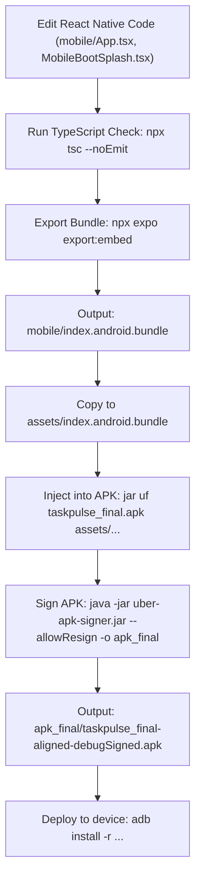

# TaskPulse — Master Context & Project Memory

> **Purpose**: This document serves as the persistent brain, technical context, and system memory for the **TaskPulse** codebase. It contains the complete architectural specifications, feature inventory, technical decisions, mobile APK patching workflows, and onboarding instructions needed to import and develop this project on any PC or AI agent environment.

---

## 1. Project Overview & Identity

* **Project Name**: TaskPulse (Enterprise Velocity Engine & Colleague Workload Platform)
* **GitHub Repository**: `Bikash0205/TaskPulse`
* **Live Web Deployment**: [https://happy-fermi-kappa.vercel.app](https://happy-fermi-kappa.vercel.app)
* **Primary Organization & Admin**: TaskPulse Technologies • Bikash (`bikash@taskpulse.io`)
* **Design Language**:
  * **Dark Glass Modernism**: `#0B0F19` (background canvas), `#0F172A` (card background), `#1E293B` (subtle border/divider).
  * **Brand Gradients**: Primary Blue/Purple `#756EF3` & `#818CF8`, Electric Indigo `#6366F1`, Emerald Cyan `#10B981` & `#34D399`, Sky Blue `#38BDF8`.
  * **Typography**: Plus Jakarta Sans, Inter, Monospace for system stats.
  * **Brand Mark**: ECG heartbeat pulse wave with rounded caps, glowing SVG Gaussian blur filters (`feGaussianBlur`), apex blink node, and neon emerald surge arrow.

---

## 2. Codebase Architecture & Directory Layout

```
happy-fermi/
├── assets/                       # Root APK staging assets (index.android.bundle, etc.)
├── apk_final/                    # Production aligned & debugSigned APK outputs
│   └── taskpulse_final-aligned-debugSigned.apk
├── mobile/                       # React Native Mobile Application (Expo SDK 52)
│   ├── assets/                   # Static & base64-encoded media assets
│   │   ├── bikashAvatarBase64.ts     # Self-contained avatar data URI
│   │   ├── bootAnimationBase64.ts    # Self-contained WebP/GIF boot animation data URIs
│   │   ├── sampleScreenshotBase64.ts # Self-contained screenshot proof data URI
│   │   ├── taskpulse_boot_animated.webp  # Lossless 32-bit RGBA 35fps animation
│   │   └── taskpulse_boot_animated.gif   # 35fps GIF fallback animation
│   ├── components/
│   │   ├── Icons.tsx                 # Zero-dependency native vector SVG icons
│   │   ├── MobileBootSplash.tsx      # High-definition boot screen with dual sonar rings
│   │   ├── MobilePulseFeed.tsx       # Real-time colleague activity feed
│   │   └── TaskPulseCard.tsx         # Mobile task item card with progress & review badges
│   ├── App.tsx                   # Master mobile application (Dashboard, Projects, Detail modal, Sign-Off)
│   ├── app.json                  # Expo application configuration (io.taskpulse.app)
│   └── package.json              # React Native 0.76.9, Expo 52, Reanimated 3
├── web/                          # Next.js 15 Web Application (React 19, Tailwind)
│   ├── app/
│   │   ├── layout.tsx            # Root layout, theme provider, metadata
│   │   ├── page.tsx              # Main desktop workspace (Project tabs, views, detail modal)
│   │   └── mobile/page.tsx       # Live in-browser mobile viewport simulator
│   ├── components/
│   │   ├── BootSplash.tsx        # Web animated boot screen with live progress track
│   │   ├── ProjectTabBar.tsx     # Horizontal pill-style project switcher & filters
│   │   ├── TaskDetailModal.tsx   # Mobile-parity task modal, checklist, manager sign-off
│   │   ├── TaskPulseCard.tsx     # Web task card with status, assignee, priority
│   │   ├── TaskPulseLogo.tsx     # Authentic vector SVG logo with Gaussian blur filters
│   │   └── ManagerDispatcher.tsx # Quick task dispatch drawer
│   ├── lib/
│   │   ├── firebase.ts           # Firebase client initialization
│   │   └── firestoreService.ts   # Firestore CRUD operations & real-time listeners
│   └── package.json              # Next.js 15, React 19, Tailwind CSS, Lucide
├── shared/                       # Shared models and data across Web and Mobile
│   ├── types.ts                  # TypeScript interfaces (Task, Project, User, Subtask, etc.)
│   └── mockData.ts               # 20 enterprise tasks across 6 workstream projects
├── scripts/                      # Automation & rendering pipelines
│   ├── generate_pure_svg_animation.py # Headless Chromium SVG frame capturer & WebP/GIF exporter
│   ├── capture_web_splash.py     # Playwright script to verify web boot animations
│   └── setup-firebase.ps1        # Firebase automated deployment script
├── install_on_device.bat         # 1-click ADB installer script for connected Android phones
├── build-apk.bat                 # EAS build automation trigger script
├── taskpulse_final.apk           # Base production APK container
└── uber-apk-signer.jar           # Multi-platform APK signer & zip-aligner utility
```

---

## 3. Core Features & Capabilities

### 3.1. Unified Project & Workstream Management
* **Top-Level Project Tab Bar (`ProjectTabBar.tsx`)**:
  * Seamless horizontal pill tabs for `All Projects` and individual workstreams:
    * `WEB`: Website Building (Next.js 15, Tailwind, SEO, Stripe)
    * `MKTG`: Digital Marketing (Paid Ads, Influencer, Landing Pages)
    * `APP`: Application Design (Design System, Wireframes, UX Polish)
    * `UNT`: Unity Dashboard (3D Workspace, Telemetry Engine)
    * `SEO`: Organic Acquisition (Content Matrix, Performance Audits)
    * `OPS`: DevOps & Infrastructure (CI/CD, Monitoring, Security)
  * Displays completion count badges (e.g., `1/4`) and active state indicator (`#756EF3`).
  * Department filters: `All`, `Engineering`, `Marketing`, `Design`, `Product`.
  * Real-time search filter across task titles, assignees, and categories.

### 3.2. Structured Category & Section Groupings
* **All Projects Mode**: Groups tasks into distinct **Project Workstream Cards** displaying target dates, velocity meters, task lists, and direct open links.
* **Single Project Mode**: Organizes tasks within that workstream into functional **Category Sections** (e.g., *Backend Architecture*, *Frontend Systems*, *Paid Campaigns*, *Creative Concepts*) with collapsible accordion headers and progress metrics.
* **Multi-View Modes**:
  * **Sections (Default)**: Visual cards grouped by workstream or category.
  * **Table View**: Structured tabular data grid with sortable columns and one-click inspection.
  * **Board View**: 4-column Kanban pipeline (*Backlog*, *In Progress*, *In Review*, *Completed*).

### 3.3. Task Detail & Manager Review & Sign-Off Protocol
* Full parity across both Web (`TaskDetailModal.tsx`) and Mobile (`App.tsx`):
  1. **Subtask Checklist**: Checkable steps with instant progress meter recalculation and inline step creation/deletion.
  2. **Workflow Progression**: `Backlog` &rarr; `In Progress` &rarr; `In Review (Manager Sign-Off)` &rarr; `Completed`.
  3. **Assignee Submission**: Assignee can submit notes and attach verification screenshot proof.
  4. **Manager Review Protocol**:
     * Managers/Admins can click `"Approve & Complete Task"` or `"Request Changes"`.
     * Once approved, displays a green *"Verified & Approved by Project Manager"* banner.
     * Task cards display the verified sign-off badge.
  5. **Fullscreen Screenshot Lightbox**: Fullscreen dark overlay allowing inspection of attached proof images with backdrop dismissal.

### 3.4. Smooth Mobile Navigation & Hardware Back Button
* **Horizontal Slide Animation**: Navigating between screens (e.g. Dashboard &rarr; Project &rarr; Task Detail) uses an `Animated.timing(navSlideAnim)` horizontal slide transition.
* **Hardware Back Interception**: Android hardware back button (`BackHandler`) slides back to the previous screen rather than abruptly exiting the app.

### 3.5. 1:1 Animated App Boot Screen (Web & Mobile Parity)
* **Web Boot Splash (`BootSplash.tsx`)**:
  * Vector SVG `<path>` stroke drawing with CSS `stroke-dashoffset`.
  * Authentic `#emerald-glow` and `#pulse-blue-glow` `<feGaussianBlur>` filters.
  * Dynamic apex circle blink and neon emerald arrow surge.
  * Monospace progress counter (0-100%) with status labels ("Initializing Velocity Engine...", "Synchronizing Workspaces...", "TaskPulse Ready").
* **Mobile Boot Splash (`MobileBootSplash.tsx`)**:
  * Uses the exact website SVG rendered via headless Chromium (`generate_pure_svg_animation.py`) at 2x Retina scale factor.
  * Lossless 32-bit RGBA animated WebP (`mobile/assets/taskpulse_boot_animated.webp`) with full 8-bit alpha channel transparency and GIF fallback.
  * Embedded as Base64 data URIs (`mobile/assets/bootAnimationBase64.ts`), decoded natively via Fresco hardware acceleration with 0 native crashes.
  * Wrapped in a native dark glass card (`#0F172A`, `#1E293B`, 24px border radius, purple elevation shadow).
  * Dual concentric breathing sonar rings (`#756EF3` & `#10B981`) and synchronized velocity progress bar.

---

## 4. Standalone APK Patching & Signing Pipeline

When modifying React Native code without recompiling the entire native Android project through Expo Cloud EAS:



### Why Base64 Data URIs Are Used for Mobile Assets
* In release APKs built by EAS, Android resolves `require('./image.png')` by querying `resources.arsc` for a compiled integer resource ID.
* When patching only `index.android.bundle`, newly added image files do not have registered resource IDs in the pre-compiled `resources.arsc`.
* By embedding assets as self-contained Base64 data URIs in TypeScript (`bootAnimationBase64.ts`, `bikashAvatarBase64.ts`), Fresco decodes the raw image directly from memory with **zero native resource dependencies and 100% crash immunity**.

### Automated 1-Click ADB Deployment
The root script `install_on_device.bat` automates device deployment:
```cmd
adb devices
adb install -r apk_final\taskpulse_final-aligned-debugSigned.apk
adb shell am force-stop io.taskpulse.app
adb shell am start -n io.taskpulse.app/.MainActivity
```
*Note: If Google Play Protect displays "Send app for a security check?", tap "Don't send" via `adb shell input tap 540 1860`.*

---

## 5. Setting Up on a New Machine (Step-by-Step)

### 5.1. System Prerequisites
* **Node.js**: v18.x or v20.x LTS
* **Git**: Installed and configured
* **Java JDK**: JDK 17+ (needed for `jar` utility and `uber-apk-signer.jar`)
* **Android Platform Tools**: `adb` added to system `PATH`
* **Python 3** (Optional, for animation generation): `playwright` and `pillow`

### 5.2. Clone & Install Dependencies
```bash
# 1. Clone the repository
git clone https://github.com/Bikash0205/TaskPulse.git
cd TaskPulse

# 2. Install Web dependencies
cd web
npm install
cd ..

# 3. Install Mobile dependencies
cd mobile
npm install
cd ..
```

### 5.3. Running the Web Application
```bash
cd web
npm run dev
```
Open [http://localhost:3000](http://localhost:3000) in your browser.
To inspect the mobile simulator on web, visit [http://localhost:3000/mobile](http://localhost:3000/mobile).

### 5.4. Running the Mobile Application (Development Mode)
```bash
cd mobile
npx expo start --clear
```
Scan the QR code with the Expo Go app or press `a` for an Android emulator.

### 5.5. Installing the Production Mobile APK to Physical Device
1. Connect Android phone via USB and enable **USB Debugging** in Developer Options.
2. In the project root, run:
```cmd
install_on_device.bat
```
The script will detect the device, install the signed APK, and automatically launch TaskPulse with the animated boot splash.

---

## 6. Environment Variables Reference

For production Firebase connectivity in `web/.env.local`:
```env
NEXT_PUBLIC_FIREBASE_API_KEY=AIzaSy...
NEXT_PUBLIC_FIREBASE_AUTH_DOMAIN=taskpulse.firebaseapp.com
NEXT_PUBLIC_FIREBASE_PROJECT_ID=taskpulse
NEXT_PUBLIC_FIREBASE_STORAGE_BUCKET=taskpulse.appspot.com
NEXT_PUBLIC_FIREBASE_MESSAGING_SENDER_ID=1234567890
NEXT_PUBLIC_FIREBASE_APP_ID=1:1234567890:web:abcdef
```
*(Note: If Firebase credentials are not supplied, the app automatically falls back to the comprehensive mock database in `shared/mockData.ts` with complete local state persistence).*

---

## 7. Key Constraints & Rules for Future Development
1. **Zero Emojis**: Never include emojis in code, logs, or UI text; use clean SVG icons from `Icons.tsx` (mobile) or Lucide (web).
2. **Visual Parity**: Every feature introduced to Mobile must be reflected on Web, and vice-versa.
3. **Type Integrity**: Maintain shared models in `shared/types.ts`. Always verify with `npx tsc --noEmit` in both `web/` and `mobile/` before bundling.
4. **Offline Asset Safety**: Keep critical mobile splash/avatar images self-contained in Base64 modules so the APK can be updated reliably without native rebuilds.
